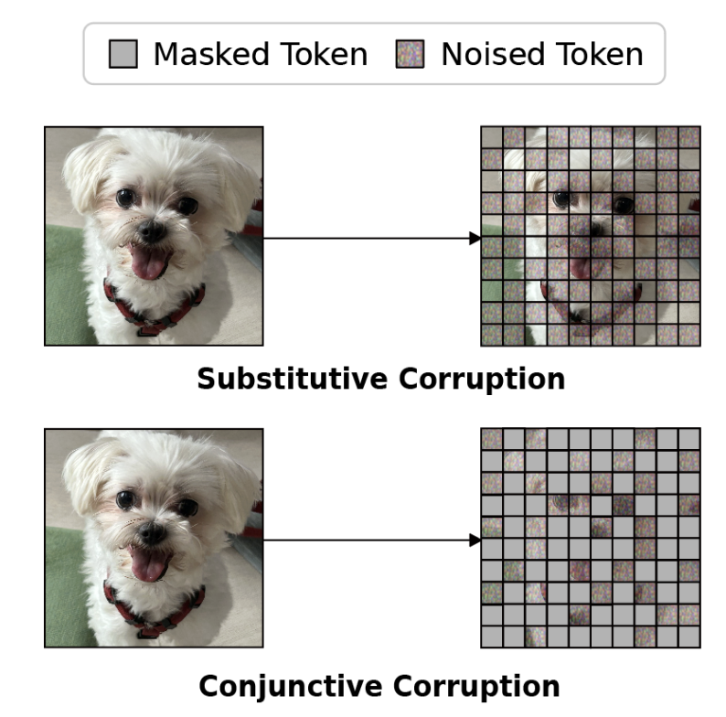
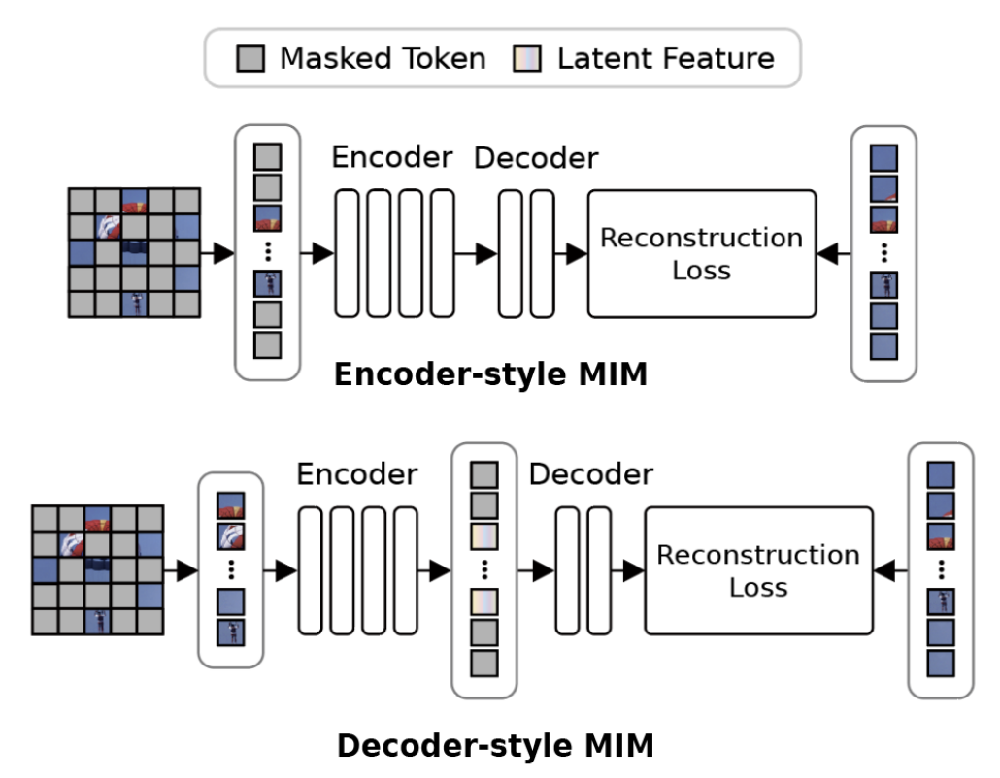

# ECC: Encoder-Centric Corruption for Fine-Grained Vision in VLMs

Official PyTorch implementation of **"ECC: Encoder-Centric Corruption for Fine-Grained Vision in VLMs"** (ECCV 2026).

[Paper] · [Project Page] · [arXiv]  <!-- 링크 확정되면 채우기 -->

> **TL;DR.** Modern VLMs suffer from a *granularity mismatch*: global contrastive alignment biases them toward low-frequency semantics and away from fine detail. ECC is a corruption-to-reconstruction (C2R) pretraining framework that unifies masking and **feature-level noising inside the encoder**, and explicitly **disentangles de-masking from de-noising** via a disruption loss. The result is a vision backbone that captures a broader frequency spectrum, improving both fine-grained recognition and the visual foundation of VLMs.

<p align="center">
  
  
</p>

---

## Highlights

- **Encoder-Centricity.** Corruption and restoration occur *within the encoder*—the component actually transferred for downstream tasks—so noising directly shapes transferable representations.
- **Feature-Level Noising.** Noise injected at intermediate encoder layers (block 2) captures high-frequency detail that pixel-space perturbation fails to model.
- **Task Disentanglement.** A disruption loss suppresses cross-corruption (masked↔noised) attention, preventing interference between the de-masking and de-noising objectives.
- **Strong & scalable.** Surpasses prior MIM and noise-based C2R baselines (up to **+8.1%** over SimMIM, **+4.4%** over MAE), and consistently improves CLIP, AIM-v2, and LLaVA when used as a vision-only pretraining strategy.

---

## Method Overview

ECC builds on the C2R paradigm but departs from prior Decoder-style designs (e.g., DiffMAE, MaskDiT) that prevent noise-induced signals from being integrated into the encoder. ECC applies **Conjunctive Corruption**—masked tokens are retained while a separate subset of visible tokens is noised—and processes all tokens within a unified encoder. The total objective combines mask reconstruction, denoising, and the disruption loss:

```
L_total = L_MIM + L_Denoise + λ · L_disruption     (λ = 0.1)
```

The disruption loss raises the entropy of masked-token attention rows in the affinity matrix, recalibrating the weight distribution so that masked tokens minimally interfere with noisy visible tokens.

---

## Installation

```bash
git clone https://github.com/<user>/ECC.git
cd ECC

conda create -n ecc python=3.10 -y
conda activate ecc

# Install PyTorch matching your CUDA version (see https://pytorch.org)
pip install torch torchvision
```

**Environment used in the paper:** ViT-B backbone, 4 × A100 GPUs.

---

## Data Preparation

Pretraining uses ImageNet-1K. Downstream evaluation covers fine-grained recognition, classification, segmentation, and detection:

| Task | Datasets |
|------|----------|
| Fine-grained recognition (FGVC) | CUB-200-2011, NABirds, iNaturalist 2017/2018, Stanford Cars, Aircraft |
| Classification | ImageNet-1K |
| Semantic segmentation | ADE20K |
| Detection / instance seg. | COCO |

Expected layout:

```
data/
├── imagenet/
│   ├── train/
│   └── val/
├── cub/
├── nabirds/
├── inat2017/
├── inat2018/
├── stanford_cars/
└── aircraft/
```

---

## Pretraining

Pretrain a ViT-B encoder on ImageNet-1K. By default we use a 400-epoch schedule, a global batch size of 4096, feature-level noise injected at encoder block 2, and a disruption-loss weight of `λ = 0.1`. The framework also supports longer schedules (800 / 1600 epochs) and larger backbones (ViT-L).

Key configuration:

| Setting | Value |
|---------|-------|
| Backbone | ViT-B |
| Schedule | 400 epochs (also 800 / 1600) |
| Batch size | 4096 |
| Noise injection block | 2 |
| Disruption-loss weight `λ` | 0.1 |
| Optimizer | AdamW (β₁=0.9, β₂=0.999), weight decay 0.05 |
| Base learning rate | 1e-4 |

---

## Fine-tuning

After pretraining, the encoder is transferred and fine-tuned on each downstream dataset. We use AdamW with a cosine-decay schedule, layer decay 0.65, drop path 0.1, 20 warmup epochs, and 100 training epochs, together with standard augmentations (RandAug, Mixup, CutMix, label smoothing, random erasing).

---

## VLM Integration

ECC is used as a **vision-only pretraining strategy that strengthens the visual foundation of VLMs**. To plug an ECC-pretrained encoder into a VLM framework (CLIP / AIM-v2 / LLaVA-1.5), replace the vision encoder with the ECC checkpoint and follow each framework's official training recipe.

---

## Results

### Fine-Grained Visual Categorization (Top-1 Acc, %)

| Method | CUB | NABirds | iNat2017 | iNat2018 | Cars | Aircraft |
|--------|-----|---------|----------|----------|------|----------|
| SimMIM | 75.40 | 73.08 | 65.50 | 69.46 | 87.94 | 73.80 |
| MAE | 79.14 | 77.86 | 68.18 | 70.84 | 92.20 | 81.56 |
| DiffMAE | 78.50 | 76.22 | 68.66 | 64.08 | 90.46 | 79.74 |
| MaskDiT | 78.80 | 77.40 | 68.46 | 68.74 | 92.00 | 80.80 |
| **ECC (Ours)** | **81.76** | **81.16** | **69.58** | **72.26** | **92.60** | **84.42** |

### ImageNet / Dense Tasks

| Method | ImageNet | ADE20K | COCO (AP^bb) | COCO (AP^mk) |
|--------|----------|--------|--------------|--------------|
| MAE | 82.74 | 43.14 | 45.86 | 41.74 |
| **ECC (Ours)** | **83.41** | **43.54** | **48.44** | **47.90** |

### VLM Integration (fine-tuning accuracy)

| Model | Backbone | Baseline | + ECC |
|-------|----------|----------|-------|
| CLIP | ViT-B/16 | 83.35 | **84.83** |
| AIM-v2 | ViT-L/14 | 86.23 | **87.11** |
| LLaVA | ViT-L/14 | 84.76 | **85.42** |

<!-- 최종본 수치와 한 번 대조하세요 -->

---

## Model Zoo

Pretrained checkpoints will be released here.

| Model | Backbone | Epochs | Checkpoint |
|-------|----------|--------|------------|
| ECC | ViT-B | 400 | _Coming soon_ |
| ECC | ViT-L | 400 | _Coming soon_ |

---

## Citation

If you find this work useful, please consider citing:

```bibtex
@inproceedings{<key>2026ecc,
  title     = {ECC: Encoder-Centric Corruption for Fine-Grained Vision in VLMs},
  author    = {<Author list>},
  booktitle = {European Conference on Computer Vision (ECCV)},
  year      = {2026}
}
```

---

## Acknowledgement

This codebase builds upon [MAE](https://github.com/facebookresearch/mae), [SimMIM](https://github.com/microsoft/SimMIM), and related masked image modeling works. We thank the authors for releasing their code. <!-- 실제로 참조한 repo에 맞게 수정 -->

## License

This project is released under the &lt;LICENSE&gt; License. See [LICENSE](LICENSE) for details. <!-- 예: MIT, Apache-2.0 -->

## Contact

For questions, please open an issue or contact &lt;email&gt;.
